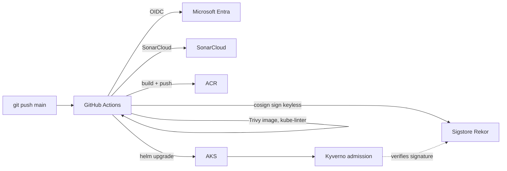

# Azure M2 — GitHub Actions → AKS (OIDC, Trivy, Cosign, Kyverno, SonarCloud)

Productionizes the deploy of the [M1 three-tier app](https://github.com/i-robert2/azure-m1-aks-3t). One push to `main` runs a full supply-chain pipeline on **GitHub Actions** — lint, test, **SonarCloud** quality gate, **Trivy** SAST + image scan + SBOM, build to **ACR**, **Cosign keyless** signing, kube-linter, then `helm upgrade` to **AKS** with a smoke test — and **Kyverno** admission rejects any pod whose image isn't signed by this repo's workflow. Auth to Azure is **OIDC**, no stored client secret.

> Built as a hands-on learning project. The whole flow (push → gates → signed image → deploy → policy enforcement → rollback) was run for real against M1's AKS, verified, and torn down.

---

## Architecture



---

## Pipeline stages

| Stage | Gate | Blocks deploy on |
|---|---|---|
| lint-test | `npm test`, `helm lint`, kube-linter, SonarCloud | failing test / quality gate |
| trivy-fs | Trivy fs scan + SBOM artifact | HIGH/CRITICAL CVE |
| build | docker build → ACR, **cosign sign**, Trivy image scan | HIGH/CRITICAL in image |
| deploy (`main`) | `helm upgrade` + smoke test + commit comment | smoke test fail |
| helm-template (PR) | renders manifest artifact, no push/deploy | — |

Image tag = **commit SHA** (`+ latest` on `main`). PRs run lint/test/SAST/Sonar + `helm template` only.

---

## What gets created

Nothing standing — M2 is CI/CD config + a small Kyverno install on **M1's existing cluster** (`rg-m1-dev-sdc-001` / `aks-m1-dev-sdc-001`, `swedencentral`). The `terraform/` here is a copy of M1's so the base can be re-applied (state key `m2.tfstate`). Cosign signatures live in ACR (<0.01 €/mo).

---

## Repository layout

```
.github/workflows/cd.yml      lint+test+Sonar -> Trivy fs -> build+sign+scan -> deploy
app/                          M1's React frontend + Node/Express API (notes.ts + tests)
charts/notes/                 M1's Helm chart (value-driven deploy)
kyverno-policies/             verify-cosign.yaml: only repo-signed images run in app ns
sonar-project.properties      SonarCloud project/org keys + test mapping
.kube-linter.yaml             chart lint config
terraform/                    M1 base infra (re-apply target, key m2.tfstate)
```

---

## Prerequisites

- M1's app + chart (carried here) and a cluster to target (re-apply `terraform/` if M1 is down).
- The shared **OIDC app registration** with federated creds for `repo:i-robert2/azure-m2-ghactions-aks:ref:refs/heads/main` + `:pull_request`, plus AcrPush, AKS Cluster User and RBAC Admin on M1's resources.
- GitHub secrets: `AZURE_CLIENT_ID`, `AZURE_TENANT_ID`, `AZURE_SUBSCRIPTION_ID`, `SONAR_TOKEN`. Variables: `ACR_NAME`, `RESOURCE_GROUP`, `AKS_CLUSTER_NAME`, `IMAGE_REPO_API`, `IMAGE_REPO_FRONTEND`, `PG_HOST`, `KEY_VAULT_NAME`, `APP_CLIENT_ID`.
- A free **SonarCloud** account (public repos are free).

---

## Setup

1. Re-apply M1 base, ingress-nginx + cert-manager (see M1 README). Note the ACR/RG/AKS/PG/KV/identity outputs.
2. Federate OIDC for this repo, grant AcrPush + AKS roles, set the secrets/vars above.
3. SonarCloud: import the repo, create `SONAR_TOKEN`.
4. `git push` → watch `gh run watch`.
5. Install Kyverno, give it an ACR pull credential (so it can fetch signatures from the **private** registry), and apply the policy:

```bash
helm repo add kyverno https://kyverno.github.io/kyverno && helm repo update
helm upgrade --install kyverno kyverno/kyverno -n kyverno --create-namespace --wait

# scoped pull token -> docker-registry secret in the kyverno namespace
PW=$(az acr token credential generate -n kyvernopull -r acrm1devsdc001 --password1 --query "passwords[0].value" -o tsv)
kubectl create secret docker-registry kyverno-acr -n kyverno \
  --docker-server=acrm1devsdc001.azurecr.io --docker-username=kyvernopull --docker-password=$PW

kubectl apply -f kyverno-policies/verify-cosign.yaml   # subject = this repo's cd.yml@refs/heads/main
```

> The policy matches `imageReferences: ["*"]` in the `app` namespace, so **every** pod image must carry a Cosign signature from this workflow. `imageRegistryCredentials.secrets: [kyverno-acr]` lets Kyverno authenticate to the private ACR; Kyverno mutates each verified image to its digest on admission. An unsigned image (e.g. `nginx`) is rejected.

```bash
cosign verify acrm1devsdc001.azurecr.io/notes-api:<sha> \
  --certificate-identity-regexp '^https://github\.com/i-robert2/azure-m2-ghactions-aks/' \
  --certificate-oidc-issuer 'https://token.actions.githubusercontent.com'
helm history notes -n app && helm rollback notes <prev> -n app --wait --timeout 90s
```

---

## Reusability — what to change

| Change | Where |
|---|---|
| Target cluster/ACR/RG/identity | GitHub repo **variables** |
| Federated subject | OIDC app fed cred + Kyverno policy `subject` |
| Quality gate | `sonar-project.properties`, SonarCloud project settings |
| CVE severity gate | `severity`/`exit-code` in `cd.yml` |
| Signed-image namespaces | `kyverno-policies/verify-cosign.yaml` match block |

---

## Security notes

- **No long-lived Azure secret** — OIDC federation only.
- **Keyless signing** — Cosign uses the GH OIDC identity; signatures + Rekor transparency log, no key to store.
- **Admission enforcement** — Kyverno rejects pods whose images aren't signed by *this* workflow identity. It reads signatures from the private ACR via a scoped, read-only pull token (`kyverno-acr`).
- **Supply-chain scanning** — Trivy fs + image gates on HIGH/CRITICAL; SBOM published as artifact.
- **Least-privilege roles** — SP gets AcrPush + AKS user/RBAC scoped to M1's resources only.

---

## Best practices demonstrated

- Stage-gated pipeline (fail fast: a failing test or HIGH CVE blocks build/deploy).
- Immutable SHA tags, idempotent `helm upgrade --install`, `helm rollback` recovery.
- Keyless signing + policy verification (Sigstore/Cosign/Kyverno) — the modern supply-chain pattern.
- PRs are plan-only (`helm template`); deploys gated behind a `production` environment.

---

## Real-world scenarios

- **Secure CD to Kubernetes** — exactly how teams ship to AKS/EKS/GKE with OIDC and no static creds.
- **Software supply-chain compliance** — sign-and-verify + SBOM + scanning satisfy SLSA-style requirements.
- **PR quality gates** — Sonar + Trivy + render-only previews before anything reaches the cluster.

---

## Issues we hit (and how we fixed them)

Real problems from wiring this pipeline up for real — the root-cause/fix is the useful part.

### Kyverno couldn't verify images from the private ACR (the big one)
**Symptom:** Every pod in `app` was denied: `failed to verify image … UNAUTHORIZED: authentication required`. Even our correctly-signed images were blocked.
**Cause:** Kyverno's `verifyImages` has to **pull the signature from the registry**, but the ACR is private and Kyverno has no credentials by default. A later red herring — "missing digest for …:tag" — was actually the *same* auth failure: with no auth, Kyverno can't resolve the tag→digest it needs.
**Fix:** Created a **repository-scoped ACR pull token** (`az acr token create … --scope-map _repositories_pull`), stored it as a `docker-registry` secret in the `kyverno` namespace, and referenced it from the policy via `verifyImages.imageRegistryCredentials.secrets: [kyverno-acr]`. Once auth worked, the default `mutateDigest: true` resolved tag→digest and admitted the signed images. Lesson: **don't disable `mutateDigest`/`required` to chase "missing digest" — fix the auth.**

### Policy let an unsigned `nginx` through
**Symptom:** `kubectl run unsigned --image=nginx` was **allowed**, defeating the point.
**Cause:** The policy's `imageReferences` only matched `notes-*` images, so nginx matched no rule and was admitted unverified.
**Fix:** Changed `imageReferences` to `["*"]` so **every** image in `app` must carry a signature from this workflow. Unsigned images are now rejected; ours pass.

### Trivy blocked the build on base-image CVEs
**Symptom:** The image scan failed with HIGH CVEs in `libcrypto3`, plus `cross-spawn`/`glob`/`minimatch`/`tar`.
**Cause:** The CVEs were in the **base image** — Alpine's openssl and the `npm` CLI's own bundled `node_modules`, not our app code.
**Fix:** In the Dockerfiles' final stage: `apk upgrade --no-cache` (fixes openssl) and `rm -rf /usr/local/lib/node_modules/npm` (the runtime doesn't need npm, and it carried the rest). Scan went clean.

### PowerShell mangled the federated-credential subjects
**Symptom:** `azure/login` failed: `AADSTS700213: No matching federated identity record` even though the creds "existed". Inspecting them showed subjects like `repo:/heads/main`.
**Cause:** Building the credential JSON inline in PowerShell (colons in `repo:…:ref:refs/heads/main`) corrupted the `subject` string.
**Fix:** Wrote each credential to an **ASCII JSON file** and passed `@file.json` to `az ad app federated-credential create`, then verified the exact subjects. Also added an `environment:production` credential since the deploy job runs in that environment.

### kube-linter failed on root containers
**Symptom:** The lint gate failed: containers "not set to runAsNonRoot".
**Cause:** The images already run as non-root, but the chart never declared it.
**Fix:** Added a `securityContext` (`runAsNonRoot: true`, the image's real UID — `10001` for the API, `101` for the unprivileged nginx — `allowPrivilegeEscalation: false`, `drop: [ALL]`) to both deployments.

### Deploy step couldn't post its audit comment
**Symptom:** The deploy succeeded but the "comment on commit" step failed with `403 Resource not accessible by integration`.
**Cause:** The workflow token defaulted to `contents: read`; creating a commit comment needs write.
**Fix:** Set `permissions: contents: write` in the workflow.

> Plus the carried-over ones from earlier projects: the dead Trivy action tag (use `@v0.36.0`) and `az acr login` needing Docker (use `--expose-token` + `cosign login` for local verification).

---

## Cost

0–3 €/mo on top of M1 (Actions free on public repos, Kyverno + Sonar + Sigstore free, signatures negligible). Deploy-verify-destroy ~€1–2; `terraform destroy` returns spend to ~€0.

---

## License

MIT — see [LICENSE](LICENSE).
